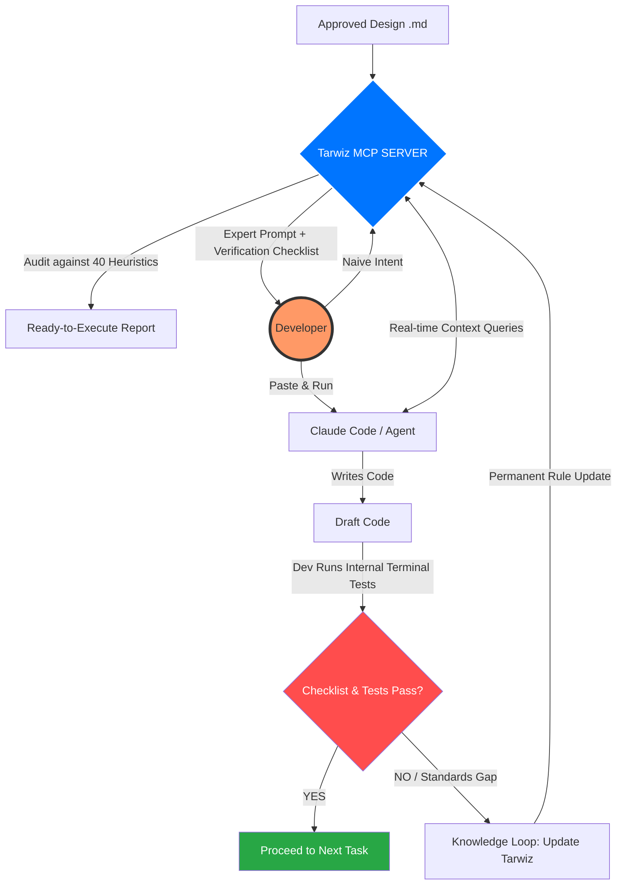

# Tarwiz-Orchestrator
> **The Engineering Governance & Acceleration Layer for Professional AI Workflows**

**Tarwiz-Orchestrator** is a reasoning and orchestration layer designed to sit between the Architect and Agentic AI tools (such as Claude Code). It utilizes the **Model Context Protocol (MCP)** to transform high-level design into deterministic, production-grade code.

---

## 🚀 The Mission: "Deterministic AI Engineering"
Tarwiz provides a **Deterministic Anchor** in a world of probabilistic AI. By using MCP as a bridge, we ensure that the AI follows senior-level architecture, security standards, and operational patterns without the user having to manually "re-prompt" the same rules every session.

---

## 🛠️ The Four Pillars of the Tarwiz Engine

### 1. Architectural Fidelity (The "Source of Truth")
Tarwiz audits the project's design against **40 Senior Heuristics**. It ensures that the AI never ignores or "hallucinates" away from the approved technical roadmap. 

### 2. Operational Standardization
Tarwiz enforces professional patterns across the entire codebase:
* **Standardized Safety:** Automatic injection of security wrappers (Argon2, JWT protocols).
* **Consistency:** Permanent enforcement of naming conventions and library choices (shadcn, Tailwind v4).

### 3. Deep Context via MCP (The "Knowledge Bridge")
We leverage the **Model Context Protocol (MCP)** to act as the "Long-term Memory" for Claude.
* **On-Demand Context:** Instead of bloating the prompt, Claude "queries" the Tarwiz MCP server for specific rules only when needed.
* **Context Efficiency:** 60-80% reduction in token waste by offloading heavy documentation to the MCP layer.

### 4. The Innovation Escape Hatch
Tarwiz is a **Baseline, not a Ceiling.** It handles the repetitive "Plumbing" so that senior engineers can use 100% of their creative energy on high-level innovation and complex problem solving.

---

## 🔄 The Aligned Workflow (The MCP-Driven Co-Pilot)

