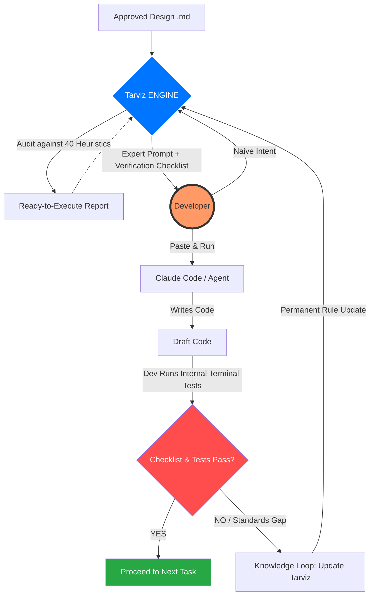

# Tarviz-Orchestrator
> **The Engineering Governance & Acceleration Layer for Professional AI Workflows**

**Tarviz-Orchestrator** is a reasoning and orchestration layer designed to sit between the Architect and Agentic AI tools (such as Claude Code). It transforms high-level design documentation into deterministic, production-grade code while eliminating the "stochastic drift" and "trial-and-error" fatigue of manual prompting.

---

## 🚀 The Mission: "Deterministic AI Engineering"
In a world of probabilistic AI outputs, Tarviz provides a **Deterministic Anchor.** It ensures that every token generated follows the senior-level architecture, security standards, and operational patterns defined at the project's inception. We are moving from "chatting with AI" to **Engineering with AI.**

---

## 🛠️ The Four Pillars of the Tarviz Engine

### 1. Architectural Fidelity (The "Source of Truth")
Tarviz audits the project's design against **40 Senior Heuristics**. It ensures that the AI never ignores, dilutes, or "hallucinates" away from the approved technical roadmap. 

### 2. Operational Standardization
Tarviz enforces professional patterns across the entire codebase, regardless of the operator's experience level.
* **Standardized Safety:** Automatic injection of security wrappers and error-handling protocols.
* **Consistency:** Permanent enforcement of naming conventions and library choices.

### 3. Context & Cost Stewardship
By surgically partitioning project knowledge into a `.claude/` directory and utilizing the **Model Context Protocol (MCP)**, Tarviz reduces "Context Bloat."
* **Cost Savings:** 60-80% reduction in token waste.
* **Higher IQ:** A leaner context window results in significantly higher-order reasoning and fewer "lazy" AI mistakes.

### 4. The Innovation Escape Hatch
Tarviz is a **Baseline, not a Ceiling.** It handles the repetitive "Plumbing" (80% of the effort) so that senior engineers can use 100% of their creative energy on **Innovation and Architectural breakthroughs.**

---

## 🔄 The Aligned Workflow (Co-Pilot Model)

